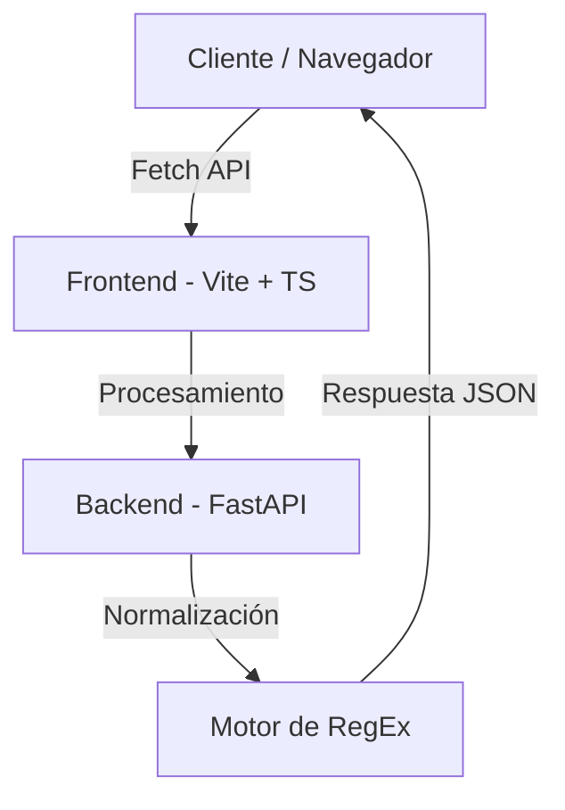

# 📡 Sector Analyzer Pro


**Sector Analyzer Pro** es una herramienta de despliegue rápido diseñada para equipos técnicos y de soporte. Permite cargar bases de datos de clientes en formato CSV, detectar automáticamente zonas geográficas y filtrar grupos afectados por fallas en segundos.

---

## 🌟 Características Principales

- 🔍 **Detección Inteligente de Columnas**: No importa el nombre de tus columnas; el sistema analiza los datos para encontrar las direcciones automáticamente.
- 🏘️ **Agrupación de Sectores**: Identifica automáticamente "Sectores", "Urbanizaciones" y "Calles" para agrupar clientes.
- ⚡ **Búsqueda en Tiempo Real**: Interfaz ultra rápida con búsqueda predictiva.
- 💎 **Diseño Premium**: Interfaz moderna con estética *Glassmorphism* y Modo Oscuro.
- 📋 **Exportación Rápida**: Copia la lista de afectados con un clic para tus difusiones.

---

## 🏗️ Arquitectura del Sistema

El proyecto sigue una arquitectura monorepo dividida en dos capas principales:



| Componente | Descripción |
| :--- | :--- |
| **Frontend** | Construido con **TypeScript** y **Vite**. Estilizado con **CSS3** puro para máximo rendimiento y control estético. |
| **Backend** | API REST desarrollada en **Python** con **FastAPI**. Encargada del filtrado pesado y la normalización de texto. |

---

## 🚀 Instalación y Uso en Local

Sigue estos pasos para poner la herramienta en marcha en tu computadora:

### 1. Clonar el repositorio
```bash
git clone https://github.com/aemsyncgd/sectorizador.git
cd sectorizador
```

### 2. Configurar el Backend (Corazón)
Se recomienda usar un entorno virtual:
```bash
# Crear y activar entorno virtual
python -m venv venv
source venv/bin/activate  # En Linux/Mac
# venv\Scripts\activate   # En Windows

# Instalar dependencias
pip install fastapi uvicorn python-multipart
```

Inicia el servidor:
```bash
python server.py
```
> [!NOTE]
> El servidor correrá en `http://localhost:8000`.

### 3. Configurar el Frontend (Interfaz)
En una **nueva terminal**:
```bash
cd frontend
npm install
npm run dev
```
> [!TIP]
> Abre tu navegador en `http://localhost:3000` (o el puerto que indique la terminal).

---

## 💻 Fragmentos del Corazón (Expert Mode)

### Normalización de Texto
El sistema elimina acentos y caracteres especiales automáticamente para que tus búsquedas nunca fallen:

```python
def normalizar_texto(texto):
    # Convierte "Dirección en Mariño" -> "direccion en marino"
    texto = unicodedata.normalize('NFD', texto)
    return "".join(c for c in texto if unicodedata.category(c) != 'Mn').lower()
```

### Detección de Zonas
Usamos potentes Expresiones Regulares para identificar sectores en lenguaje natural:
```python
patron = r"(sector|calle|urb\.|barrio)\s+([a-z0-9\sñáéíóú]+?)(?=[,\.]|$)"
```

---

## ☁️ Despliegue en la Nube
Este proyecto está configurado para desplegarse fácilmente en **Vercel**. 
Solo importa el repositorio y Vercel usará el archivo `vercel.json` para orquestar los Serverless Functions de Python y el build de Vite.

---
**Desarrollado con ❤️ por el equipo de ingeniería**
